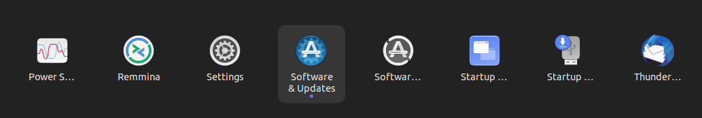
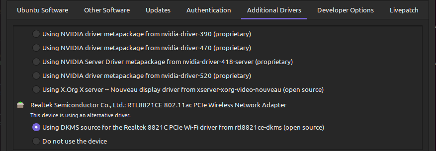

Congrats on successfully installing Ubuntu! The installation was pretty easy, isn't it? Well, not to rain on your parade, there are still a tad bit of things you need to know and set up in order to fully enjoy your newly installed Linux distro. No need to worry. I've got it covered.

## Wifi Setup

> Before anything else, it is important that our pc/laptop can connect to the internet. In windows, this is automatically set up for us. However, in most Linux-based operating system, we are given the liberty to configure it on our own. As you can observe from checking out the topbar menu, we see that wifi is nowhere to be found. And this is due to the system's default setting of not using our device's wireless network adapter. 

To correct this, go to "Apps" then click "Software & Updates".

Select "Additional Drivers", look for "Wireless Network Adapter" and choose to use driver.
  
Finally, apply changes and reboot device.

## Update and Upgrade Packages

> As a new linux user, it is important to remember to update and upgrade packages whenever available. You need this for system bug fixes, maximizing and maintaining security, and improving performance.

To update and upgrade packages in Ubuntu. Simply open the terminal and paste the command below.  

    sudo apt update &&  sudo apt upgrade -y
     

## Basic Linux Commands

> Learning basic linux cli commands is a must if you want to optimize work. As a former window's user, you are accustomed to doing everything using GUI. However, never underestimate the power of CLI. Utilizing CLI over GUI can help you understand the underlying processes of your system and get a better understanding of it. This is extremely valuable especially if you are an aspiring software engineer!

Here are commonly used commands:

- **pwd (print working directory)** - this command simply prints out the path of directory you are currently working in
- **mkdir (make directory)** - using this command creates a new directory/folder
- **ls (list)** - this is used in listing files and/or directories 
- **cd (change directory)** - used to change/move from one directory to another
- **rm (remove file)** - delete a file/directory using this command. P.S. File is permanently deleted thus there is no way of getting it back.
- **touch (create new empty file)** - creates a new empty file
- **man (read the manual)** - this command is extremely helpful. This gets you the documentation of any linux commands.
- **sudo (elevate user privileges)** - this enables you to temporarily elevate your user account into a super/root user

 

Now, you are set! Remember, this is only the tip of the iceberg. There are much more concepts you have learn from here on out. So, stay curious and practice practice practice! 

