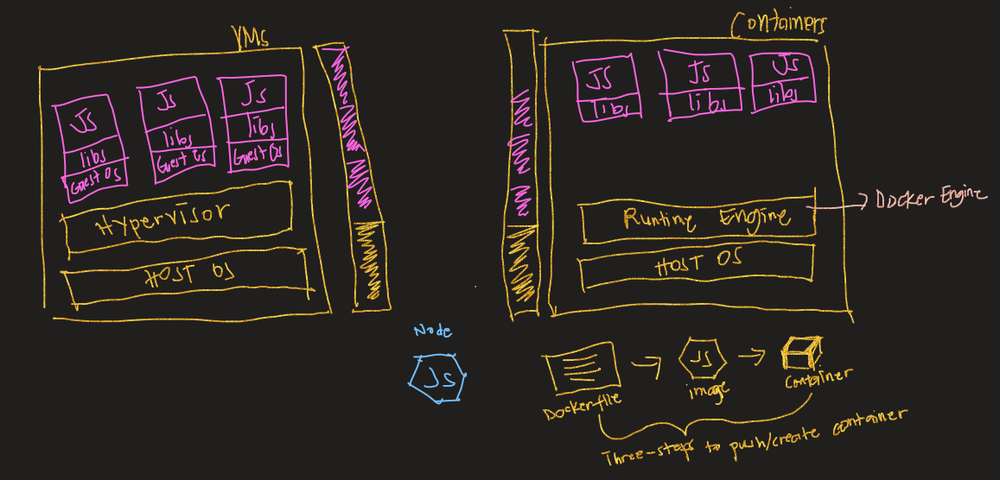
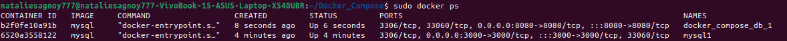
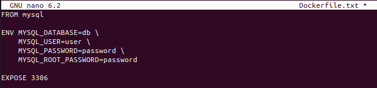
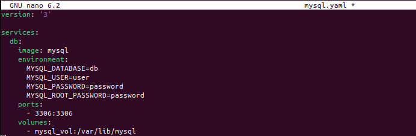
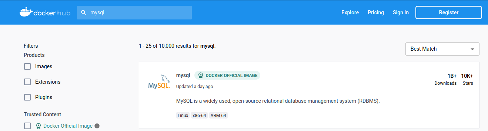

In this article, we will tackle the basic concepts, terminologies and/or tools, and reasons why you should use Docker.

----

## What is Docker?
Docker is a tool/technology that allows developers to build, test and deploy their applications quickly. With docker, it is possible to run interconnected applications simultaneously and contain them in an isolated environment. It utilizes the concept of **"Containerization"** which is an improved concept of **"Virtualization"** wherein the operating system layer is removed. Allowing applications to run independently of the host operating system and also preventing resource waste.

  
As illustrated in the image above, virtual machines and containers are quite similar with one another. Both share the core concept of virtualization. However, the difference between the two is that "virtual machines" virtualizes an instance of an entire machine which includes it own OS while "containers" shares the host OS kernel thus making it lightweight.  

**Reasons why you should use Docker :**
1. Makes your application portable
2. You can distribute your application in any platform without any compatibility issues
3. Resource effective
4. Lightweight
5. Encourages CI/CD pipeline

## Terminologies and/or Tools

- **Docker Image** - is an executable file which contains a set of instructions on how a container is built (like a template).

    
- **Docker Container** - is a running instance of a docker image.

    
- **DockerFile** - is a text document that serves as a blueprint in building/creating docker images.

    
- **Docker Compose** - is a tool used to contain and run multiple instances of docker images along with its configuration. With this, we won't have to perform "docker run" one by one.

    
- **Docker Hub** - is a cloud-hosted docker registry wherein docker images/containers are stored and shared. Official images of applications are available in Docker hub. It is like GitHub but for docker images/containers.
  
    

