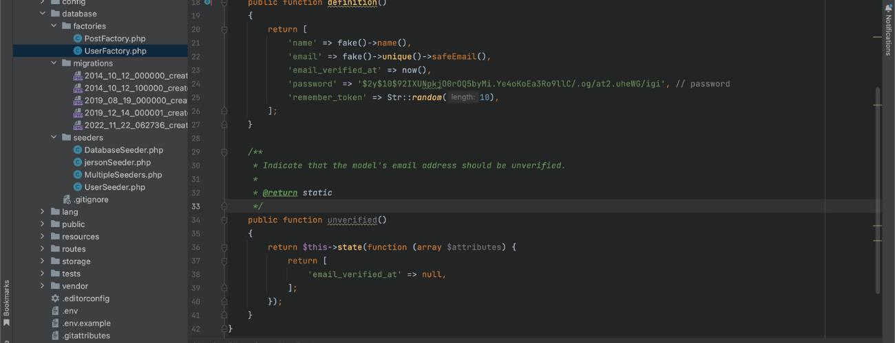

Web application frameworks is "a software framework that is meant to assist the creation of web applications including web services, web resources, and web APIs." In layman's terms, web frameworks are pieces of software that allow you to design and execute web applications. As a result, you don't have to write on your own and hunt for any errors and miscalculations.

Web frameworks were established in the early days of web app development as a way to eliminate hand-coding of apps where only the creator of a specific app could update it. The advancement of web development now we have web-specific languages that allow developers to solve altering the structure of an app has been overcome by the emergence of general performance. In this article, we are going to focus on the Laravel web application framework specifically for **Laravel seeding**

<br>

## Laravel - PHP Web Application Framework
Laravel is a reliable and simple-to-use open-source PHP framework. It adheres to the model-view-controller pattern of design. Laravel makes use of pre-existing parts from other frameworks to build online applications. The resulting web application is more organized and practical.

Incorporating the fundamental components of PHP frameworks like CodeIgniter and Yii as well as other programming languages like Ruby on Rails, Laravel provides a wide range of functionalities. The extensive feature set of Laravel will accelerate web development.

<br>

## Objectives
- You will learn what is seeding
- What is the importance of seeding in development
- How to  create/generate dummy data for your database table using seeder and Faker
- Know the difference between seeding and migration

<br>

## Laravel Seeding

**What is seeding?** To make it simple Data seeding is the process of populating a database with an initial set of data.

In Laravel December 24, 2020. Database seeding is the process of populating data tables with fictitious data. This procedure is used by developers for testing. Using seeder classes, Laravel allows you to fill data tables with test data. The database/seeds directory contains all seeder classes. Laravel offers the ability to use seed classes to populate your database with data. The database/seeders directory contains all seed classes. 

<br>

## Importance of seeding for development
In the development process, it is crucial for software developers to use production data as the initial data set for their software applications. Data security and privacy are important for the client, to solve this problem data seeding was introduced to developers, this type of mechanism can make testing for performance and database management **efficient and accurate**.


<br>

## Applying Seeding

Now that know you what is seeding, let's try to create your first seeder.

I assume that you already created your Laravel project and configure the connection for your preferred database. If you haven't created your `Laravel project` you start by following this command below: 

**Create Laravel Project**

```
composer create-project laravel/laravel [project_name]
```

**Change Directory:**

```
cd /.../[project_name]
```

**Let's try if you can use PHP artisan command:**

```
php artisan list
```

After running the command `php artisan list` it will show you the all the command available for laravel project.

<br>


I am assuming that you can connect with your preferred database, if you haven't you can configure your connection on your `.env` file in your Laravel project.

**Sample Code:**


<br>


## Laravel Seeding 
Now that you created your fresh Laravel project we will proceed with creating and running seeders in your Laravel project

In your Laravel project, you have the capability to seed your database with data using seed classes. Laravel project store your seed classes inside the `database/seeders` directory. 

<br>

## Writing Seeders
In writing seeders in laravel your need to the following:
- Using model factories
- Call seeders
- Muting Models Events (optional)

Creating / making seeders in laravel is pretty straight forward just follow the steps below:

**To generate a new seeder, execute the following command `make:seeder`. All of your seeders will be placed in the `database/seeders` directory of your Laravel project.**

```
php artisan make:seeder [seeder_name]
```

After you able to make the seeder, go to your `database/seeders` folder and open the seeder class that you created. 
Inside your seeder class you can see that there is a `run()` method already generated in your seeder class. The `run` method will be one `php artisan` will execute when you run your seeder class later.


<br>
Additional information, if you are having trouble making commands on your Laravel you can use this to know all the commands you can use PHP artisan list on your Laravel project.

```
php artisan list
```

In your `run() method` you can try to insert this following code:

```
<?php

namespace Database\Seeders;

use Database\Factories\UserFactory;
use Illuminate\Database\Console\Seeds\WithoutModelEvents;
use Illuminate\Database\Seeder;
use Illuminate\Support\Facades\DB;
use Illuminate\Support\Facades\Hash;
use Illuminate\Support\Str;
use App\Models\User;

class UserSeeder extends Seeder
{
    /**
     * Run the database seeds.
     *
     * @return void
     */
    public function run()
    {
        for($i = 0; $i <10; $i++){
            DB::table('users')->insert([
                'name' => Str::random(10),
                'email' => Str::random(10).'@gmail.com',
                'password' => Hash::make('password'),
            ]);
        }
    }
}

```
Your run method inside the seeder class that you created should look like this by now.

**What does this code do? In this snippet code we are seeding our user's table 10 random data for `name, email and password`**


<br>
Sample: 


After that you need to run this to your command:

```
php artisan db:seed --class=[class name]

```
With command, you are able to seed your database `users` table.

After you are able to successfully execute the `php artisan db:seed`, if you check your database, your database should have a table named `users` with 10 row of data.

Sample: 


<br>

## Model Factories 
As a developer it is not efficient to manually specify the attributes of your seeder class. What we can do is we can utilize Laravel model factories which automatically generate of database records for you.

Follow the command below to  generate your custom `factory`:

```
php artisan make:factory [factory_name]

```
after you execute the command your factory will be located in your `database/factories`.
`

In your database factories, you can see there is already a `UserFactory` generated in your directory. For now, we can utilize that factory use it for the user `users table`. It should look like this:



Let me explain what is happening in this code snippet. In your `UserFactory` there is a `definition()` what does it do? 
The `definition` method returns the default set of attribute values that should be applied when creating a model using the factory.

In our factory, we are going to utilize `Faker PHP library` which can use to generate random data for seeding. The php faker library offers different data that it can generate. This is some of the following data list that faker offers:

**Faker Generate the following data**
- Base
- Lorem Ipsum Text
- Person
- Address
- Phone number
- Company
- Reat Text
- Date and Time
- Payment
- Color
- Uuid
- File


Let's try to use our `UserFactory` sample to seed 100 data for user tables.

Replace the inside of your `run()` in your seeder with this:

```
[table_name]::factory()
            ->count([data_size])
            ->create();
```

Your `run()` should look like this:

Sample:


As you can observe we are using the `UserFactory` in your `database/Factories` directory, if you notice inside the `run()` method we are calling User model from you `app/Models`. What does those model do? eloquent models set the attributes for your database table.

<br>

After that, run the command calling your seeder class:

```
php artisan db:seed --class=[class name]

```

Your database should be seeded with data depends on what is the size you specify in your `count()` method for your `factory()` method.


<br>

## Running Multiple Seed Classes

To run multiple seeder classes at one seeder class you need to utilize the call function in your project which will execute the other seeder classes that you want to run. The call method accepts an array of seeder, follow the command below:

Let's create a new seeder class which will use to run multiple seeders:

```
php artisan db:seed --class=[class name]

```

After that, in the run method we are going to use the call method to execute our seeders:


```
        $this->call([
           [class_name]::class
           [class_name]::class
           [class_name]::class
        ]);
```

For now, as what did above you need to create a factory for each of your seeder classes. After your created your seeder `factories and models`. Let's run the multiple seeders at once using your created seeder class to hold your multiple seeder classes:

Sample:


```
php artisan db:seed --class=[class_name]
```

In this way, you can execute `multiple seeders` in one seeder class.

<br>

## Muting Model Events
### What is a Model? How Model affect our Seeders in general? 

In Laravel, when you will use an `object-relational mapper (ORM)` which enables able you to interact with your database. When you are using Laravel eloquent, each of your database tables has its corresponding model and model events, which is used to interact with your table. The usage of the model in Laravel allows you to execute database commands such as insert, update and delete in your database tables.

Unlike migrations which we can utilize Laravel models for now, in this article, we are only going to focus on seeders and seeding in general so what we can do to avoid your seeders utilizing models is mute them when you run your seeders `run()` method.

In muting models events, you can add this code inside your seeder class:

```
use WithoutModelEvents;
```

Sample:


After muting the models in your seeder class, you can try to execute your seeder class.

<br>

## Additional Information in Running Seeders
In running your seeder we demonstrated the command on how you can execute your seeder class, but you can also use `migrate:fresh` command with  `--seed` option.
What does it do? `migrate:fresh` command will drop all tables and re-run all of your database migrations. This is useful when you are trying to rebuild your database tables.

```
php artisan migrate:fresh --seed
```

or you can specify the seeder class you want to execute using this:

```
php artisan migrate:fresh --seed --seeder=[seeder_name]
```

Soon you will encounter a prompt message which prohibits you to execute seeding in your database, this happens when you are about to alter, or you may lose data executing the specific command. 
Here how can you force execute your command seeder : 

```
php artisan db:seed  --seeder=[seeder_name] -force
```


<br>

## Difference Between Seeding and Migrations

Seeding, in general, is a database utility that offers you to easily populate your database table with random data automatically, the purpose of seeding is to make developers easily test the database tables. Using seeder allows you as a developer to detect bugs and optimize the performance of your database. On the other hand, Laravel migration/migration, in general, is a way for devlopers to handle data from the database, which offers better capability the only seeding itself, migrations are designed to handle the creation of tables, adding and modifying your database schema and tables columns.

<br>

## Summary

To sum it all up, Using seeding is one of the database utilities that you can use to make your testing and database efficient and bug-free. Instead of working on production data which may cause problems and security issues (client privacy data), by using the faker PHP library, you will be able to test dummy data for your database.
